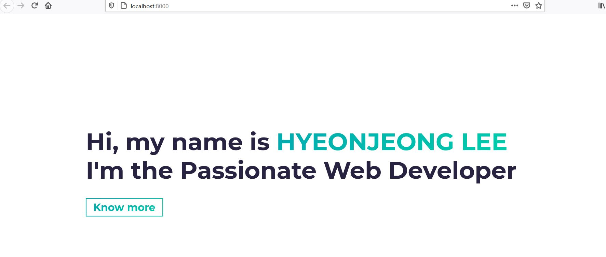

<h3>리액트 템플릿 가져오기 - 2</h3>

사실 빈 프로젝트에서 디자인하기란 제 디자인 능력으로는 포토샵으로 그림판 수준밖에 내질 못합니다..
이럴 땐 역시....템플릿이겟죠
능력자 분들이 만들어둔 디자인과 이벤트들을 무료로 한 번 이용해봅시다

포트폴리오 페이지를 구성하고 있기 때문에 저는 single page로 구성된 템플릿으로 찾았습니다.
생각보다 무료로 제공하는 템플릿도 많습니다

제가 좋아하는 템플릿 사이트 입니다. 무료도 있고 유료도 제공됩니다
무료도 퀄리티가 좋아서 현재 프로젝트에서 사용중입니다.
리액트 이외에도 부트스트랩, vue.js등 다양한 템플릿을 제공하고 있습니다. 
<a href="https://www.creative-tim.com/templates/react-free">Creative Team </a>

이번에는 마음에 드는 템플릿 구성이 없어서 구글에 react free template이라고 치니
이런 멋진 포스팅이 나왔습니다. 
<a href="https://dev.to/davidepacilio/35-free-react-templates-and-themes-32ci">템플릿 모음 사이트</a>

저는 이 중에서 <a href="https://github.com/cobidev/gatsby-simplefolio">Gatsby Simplefolio</a>를 선택했습니다.
앞으로는 이 템플릿 위주로 포스팅이 진행될 예정입니다.

<b>시작하기 전에 node.js를 미리 설정해주세요. 이 포스팅은 vs코드 기반으로 작성되었습니다. </b> 

<h2>리액트 템플릿 가져오기</h2>

1. 해당 프로젝트의 github 방문해주세요 혹은 소스코드 다운로드가 제공된다면 받아주세요

2. code 버튼을 눌러서 download ZIP 파일로 받아주시거나 clone으로 받아오시면 됩니다.
   저는 clone으로 받아왔습니다~

   
   * 코드를 fork하셔서 바로 자신의 레파지토리에서 구성해서 쓰셔도 좋습니다:)

3. 새 윈도우 창을 켜서 clone 해주시거나 해당 ZIP파일 압축을 푸신 폴더를 드래그앤 드랍 해주세요
   클론을 하시는 경우 폴더를 여는 탐색창이 나옵니다. 원하는 폴더를 선택해주세요
   

4. 열어주세요!
   

5. 완성!
   

6. 이제 리액트를 실질적으로 실행하기 위한 npm install을 설치하지면 정말 끝입니다.

7. 설치가 끝난 후 npm start 하면
   아래와 같은 웹사이트가 실행됩니다!
   

저는 지금까지계속 npm을 써왔는데 yarn이 속도가 훨씬 빠르다고 해서
yarn으로 갈아탈 시기를 엿보고 있습니다! 처음 시작하시는 분들은 yarn으로 하시는 걸 추천드려요~
이제 포트폴리오를 받아왔으니 리액트강의를 들으면서 포트폴리오 작업을 진행해보겠습니다.

강의는 순차적으로 들을 예정이지만 포트폴리오 작업을 우선적으로 하면서 개념정리를 할 예정입니다.
